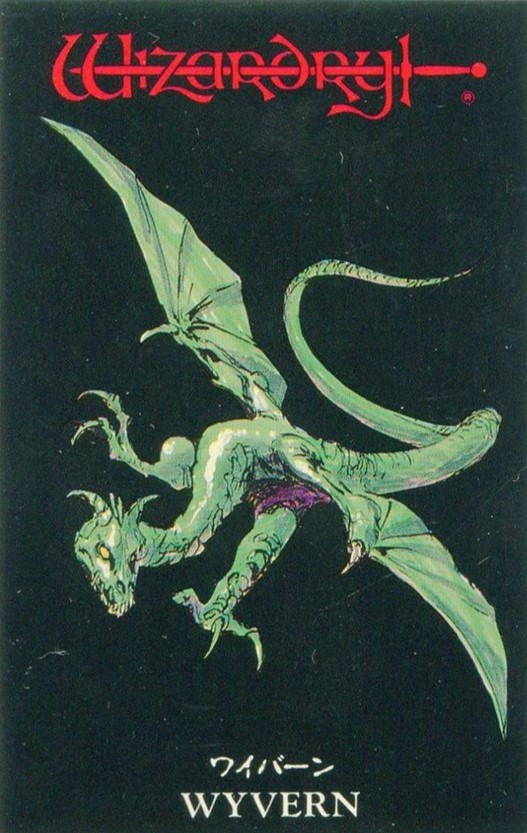

   

### Inspiration

I came across a bunch of online pictures of a card game from the 1990s, and after doing some extensive research, I stumbled upon the new universe of [Wizardry](https://en.wikipedia.org/wiki/Wizardry) and the artist [Jun Suemi / 末弥 純](https://ja.wikipedia.org/wiki/%E6%9C%AB%E5%BC%A5%E7%B4%94). So, I decided to put together this simple gallery with the coolest information I could find.

>Game deployed [HERE](https://incomparable-beignet-36f46c.netlify.app/) :)

### More Information

- Cards descriptions: [pekori.jp](http://www.pekori.jp/~emonoya/goods/card/card_fc1.html)
- Card images (bad quality): [plala.or.jp](http://www8.plala.or.jp/Wizardry/monstercards.html)
- More Jun Suemi art: [videogamesdensetsu.tumblr](https://videogamesdensetsu.tumblr.com/post/167165627140/jun-suemi-%E6%9C%AB%E5%BC%A5-%E7%B4%94-part-1-1984-1989-part-2)
-Soundtrack of the game: [khinsider](https://downloads.khinsider.com/search?search=wizardry)

### Special mention

In [MobyGames](https://www.mobygames.com/) i found the major of the information, consoles, years, descriptions and the photos of the games but nothing about the card game, that information is in pekori.

